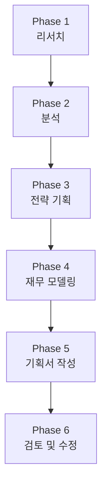

# 🍊 온라인 과일 커머스 사업기획서 — 에이전트 기반 작성 계획

> **프로젝트 목표**: 한국 과일시장 데이터를 분석하고, 온라인 과일 커머스에 대한 종합적인 사업기획서를 작성한다.  
> **고객 유형**: ① 도매 업체 (B2B) ② 일반 고객 (B2C)

---

## 📂 입력 자료 (input/)

| 파일명 | 내용 (추정) |
|--------|-------------|
| `14chaper_report.pdf` | 과일산업 종합 보고서 (14장 분량) |
| `PRN229.pdf` | 과일산업 관련 연구/정책 보고서 |
| `out25_3_2_2_4_presentation.pdf` | 과일시장 프레젠테이션 자료 |
| `과일소비트렌드변화와과일산업대응방안.pdf` | 과일 소비 트렌드 변화 분석 및 산업 대응 방안 |

---

## 🤖 사용할 에이전트 구성

### Agent 1 — 📖 **리서치 에이전트 (Research Agent)**
- **역할**: 입력 PDF 분석 + 웹 리서치를 통한 시장 정보 수집
- **수행 업무**:
  - input/ 폴더의 4개 PDF를 분석하여 핵심 데이터 추출
  - 한국 과일시장 규모, 성장률, 주요 트렌드 정리
  - 온라인 과일 커머스 시장 현황 조사 (국내외)
  - 소비자 트렌드 분석 (건강, 프리미엄, 친환경 등)
  - 도매(B2B) 시장과 소매(B2C) 시장의 차이점 조사
  - 경쟁사 분석 (마켓컬리, 오아시스마켓, SSG 등)
- **출력**: `research/` 폴더에 분석 보고서 생성

### Agent 2 — 📊 **분석 에이전트 (Analysis Agent)**
- **역할**: 리서치 결과를 기반으로 전략적 분석 수행
- **수행 업무**:
  - SWOT 분석
  - PEST 분석 (정치/경제/사회/기술)
  - 경쟁 구도 분석 (Five Forces)
  - 고객 세그먼트 분석 (B2B 도매 vs B2C 일반)
  - 가치 제안 (Value Proposition) 설계
  - 수익 모델 분석
- **출력**: `analysis/` 폴더에 분석 결과 생성

### Agent 3 — 🏗️ **전략 기획 에이전트 (Strategy Agent)**
- **역할**: 사업 전략 및 실행 계획 수립
- **수행 업무**:
  - 비즈니스 모델 캔버스 (BMC) 작성
  - B2B 도매 플랫폼 전략 설계
  - B2C 소비자 플랫폼 전략 설계
  - 마케팅 전략 (온라인/오프라인)
  - 운영 계획 (물류, 재고, 품질관리)
  - 기술 스택 및 플랫폼 아키텍처 설계
  - 조직 구성 및 인력 계획
- **출력**: `strategy/` 폴더에 전략 문서 생성

### Agent 4 — 💰 **재무 에이전트 (Finance Agent)**
- **역할**: 재무 모델링 및 투자 계획 수립
- **수행 업무**:
  - 초기 투자 비용 산출
  - 매출 추정 (B2B + B2C 별도)
  - 손익 분기점 분석
  - 3개년 재무 계획 (P&L, Cash Flow)
  - 자금 조달 계획
  - ROI 분석
- **출력**: `finance/` 폴더에 재무 계획 생성

### Agent 5 — 📝 **기획서 작성 에이전트 (Documentation Agent)**
- **역할**: 모든 결과물을 종합하여 최종 사업기획서 작성
- **수행 업무**:
  - 전체 에이전트 산출물 통합
  - 사업기획서 목차 구성 및 집필
  - 시각 자료 (차트, 다이어그램) 생성
  - HTML/PDF 형식의 프레젠테이션용 기획서 제작
- **출력**: `output/` 폴더에 최종 사업기획서 생성

---

## 📋 작업 단계 (Workflow)



### Phase 1: 리서치 (Research) — 리서치 에이전트
| 단계 | 작업 내용 | 산출물 |
|------|----------|--------|
| 1-1 | input/ PDF 4개 분석 및 핵심 데이터 추출 | `research/pdf_analysis.md` |
| 1-2 | 한국 과일시장 현황 웹 리서치 | `research/market_overview.md` |
| 1-3 | 온라인 과일 커머스 트렌드 조사 | `research/ecommerce_trends.md` |
| 1-4 | 경쟁사 분석 | `research/competitor_analysis.md` |
| 1-5 | B2B 도매시장 특성 조사 | `research/b2b_market.md` |
| 1-6 | B2C 소비자 행동 조사 | `research/b2c_consumer.md` |

### Phase 2: 분석 (Analysis) — 분석 에이전트
| 단계 | 작업 내용 | 산출물 |
|------|----------|--------|
| 2-1 | SWOT 분석 | `analysis/swot.md` |
| 2-2 | PEST 분석 | `analysis/pest.md` |
| 2-3 | 5 Forces 경쟁 구도 분석 | `analysis/five_forces.md` |
| 2-4 | 고객 세그먼트 분석 (B2B/B2C) | `analysis/customer_segments.md` |
| 2-5 | 시장 기회 및 위험 요인 정리 | `analysis/opportunities_risks.md` |

### Phase 3: 전략 기획 (Strategy) — 전략 기획 에이전트
| 단계 | 작업 내용 | 산출물 |
|------|----------|--------|
| 3-1 | 비전/미션/핵심 가치 정의 | `strategy/vision_mission.md` |
| 3-2 | 비즈니스 모델 캔버스 작성 | `strategy/bmc.md` |
| 3-3 | B2B 플랫폼 전략 | `strategy/b2b_strategy.md` |
| 3-4 | B2C 플랫폼 전략 | `strategy/b2c_strategy.md` |
| 3-5 | 마케팅/영업 전략 | `strategy/marketing.md` |
| 3-6 | 운영/물류 계획 | `strategy/operations.md` |
| 3-7 | 기술 및 플랫폼 설계 | `strategy/tech_architecture.md` |
| 3-8 | 로드맵 (단계별 실행 계획) | `strategy/roadmap.md` |

### Phase 4: 재무 모델링 (Finance) — 재무 에이전트
| 단계 | 작업 내용 | 산출물 |
|------|----------|--------|
| 4-1 | 초기 투자 비용 산출 | `finance/initial_investment.md` |
| 4-2 | 매출 추정 모델 (B2B + B2C) | `finance/revenue_model.md` |
| 4-3 | 3개년 손익 계획 | `finance/pnl_projection.md` |
| 4-4 | 손익 분기점 분석 | `finance/break_even.md` |
| 4-5 | 자금 조달 및 투자 계획 | `finance/funding_plan.md` |

### Phase 5: 기획서 작성 (Documentation) — 기획서 작성 에이전트
| 단계 | 작업 내용 | 산출물 |
|------|----------|--------|
| 5-1 | 사업기획서 목차 구성 | `output/outline.md` |
| 5-2 | 전체 내용 통합 집필 | `output/business_plan.md` |
| 5-3 | 시각 자료 및 차트 생성 | `output/` 내 이미지 파일 |
| 5-4 | 프레젠테이션용 HTML 기획서 제작 | `output/business_plan.html` |

### Phase 6: 검토 및 수정 (Review)
| 단계 | 작업 내용 | 산출물 |
|------|----------|--------|
| 6-1 | 전체 기획서 일관성 검토 | 수정본 |
| 6-2 | 수치/데이터 검증 | 수정본 |
| 6-3 | 사용자 피드백 반영 및 최종본 확정 | `output/business_plan_final.html` |

---

## 📁 폴더 구조 (예상)

```
fruits/
├── input/                          # 입력 자료 (기존)
│   ├── 14chaper_report.pdf
│   ├── PRN229.pdf
│   ├── out25_3_2_2_4_presentation.pdf
│   └── 과일소비트렌드변화와과일산업대응방안.pdf
├── research/                       # Phase 1 산출물
│   ├── pdf_analysis.md
│   ├── market_overview.md
│   ├── ecommerce_trends.md
│   ├── competitor_analysis.md
│   ├── b2b_market.md
│   └── b2c_consumer.md
├── analysis/                       # Phase 2 산출물
│   ├── swot.md
│   ├── pest.md
│   ├── five_forces.md
│   ├── customer_segments.md
│   └── opportunities_risks.md
├── strategy/                       # Phase 3 산출물
│   ├── vision_mission.md
│   ├── bmc.md
│   ├── b2b_strategy.md
│   ├── b2c_strategy.md
│   ├── marketing.md
│   ├── operations.md
│   ├── tech_architecture.md
│   └── roadmap.md
├── finance/                        # Phase 4 산출물
│   ├── initial_investment.md
│   ├── revenue_model.md
│   ├── pnl_projection.md
│   ├── break_even.md
│   └── funding_plan.md
├── output/                         # Phase 5 최종 산출물
│   ├── outline.md
│   ├── business_plan.md
│   └── business_plan.html
└── business_proposal_plan.md       # 이 파일 (작업 계획)
```

---

## 🔑 핵심 고려사항

### B2B (도매 업체) 특화 기능
- 대량 주문 시스템 및 볼륨 할인
- 정기 배송 / 계약 기반 거래
- 거래처 전용 가격표 및 견적 시스템
- 세금계산서 자동 발행
- 전용 영업 담당자 배정
- 품질 인증서 및 이력 추적

### B2C (일반 고객) 특화 기능
- 소량 포장 / 선물 포장
- 구독 서비스 (정기 과일 박스)
- 리뷰/평점 시스템
- 제철 과일 큐레이션
- 간편결제 / 모바일 최적화
- 레시피/활용법 콘텐츠

### 공통 인프라
- 신선도 관리 및 콜드체인 물류
- 실시간 재고 관리
- AI 기반 수요 예측
- 산지 직송 시스템

---

## ⏱️ 예상 작업 일정

| Phase | 소요 시간 (예상) | 누적 |
|-------|-----------------|------|
| Phase 1: 리서치 | 1회 세션 | 1회 |
| Phase 2: 분석 | 1회 세션 | 2회 |
| Phase 3: 전략 기획 | 1회 세션 | 3회 |
| Phase 4: 재무 모델링 | 1회 세션 | 4회 |
| Phase 5: 기획서 작성 | 1~2회 세션 | 5~6회 |
| Phase 6: 검토/수정 | 1회 세션 | 6~7회 |

> 💡 각 Phase는 사용자 확인 후 다음 단계로 진행하여 방향성을 조율합니다.

---

## 🚀 시작 방법

**Phase 1부터 시작하려면** 다음과 같이 요청하세요:

> "Phase 1 리서치를 시작해줘"

각 Phase 완료 후 산출물을 검토하고, 피드백을 반영한 뒤 다음 Phase로 넘어갑니다.
