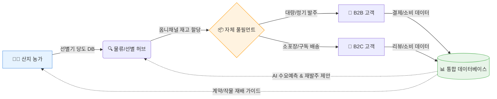
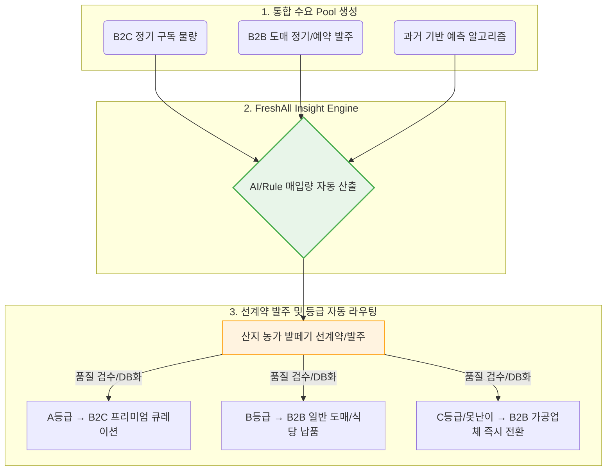

# 사업 전략 종합

---

## 1. 사업 전략 및 배경

### 1-1. 최우선 질문: "왜 이 팀이 할 수 있는가?" (Execution Proof)
본 프로젝트는 제로 베이스의 스타트업이 아닌, **이미 검증된 오프라인 자산을 기반으로 한 확실한 DX(디지털 전환)**입니다. 단순한 IT ‘결합’이 아닌 실물 인프라 위에 IT를 얹어 즉각적인 수익 창출이 가능합니다.

**[현재 보유 중인 압도적 실물 자산 및 실적]**
- **기존 거래처**: B2B 도매 거래처 OOO곳 확보 (안정적 매출 기반)
- **산지 네트워크**: 전국 주요 산지 직거래 농가 OO곳 독점/우선 계약
- **물류 인프라**: [지역명] 거점 자체 창고 OO평 보유 (Hub & Spoke 즉시 가동 가능)
- **월 취급 물량**: 월평균 과일 유통량 OO톤 
- **기존 매출 규모**: 연매출 OO억 원 달성 중

### 1-2. "왜 종합 식품이 아닌 과일인가?" (Why Fruit?)
투자자와 시장이 묻는 "왜 하필 과일부터인가?"에 대한 명확한 해답입니다.
- **SKU 단순화에 따른 효율성**: 공산품이나 다품종 신선식품 대비 카테고리가 명확하여 재고 및 물류 관리가 용이함.
- **압도적인 반복 구매율**: 소비 주기가 짧고 정기적 섭취가 이루어지는 식재료로, **구독 모델 및 락인(Lock-in)에 가장 적합**.
- **데이터 표준화의 용이성**: 산지, 크기, 당도(Brix) 등 명확한 정량적 지표가 존재하여 **데이터베이스화 및 AI 학습에 최적화**된 카테고리.

### 1-3. 비전 및 미션
> **비전**: "오프라인 과일가게 사장의 안목을 디지털화하여, 소비자의 과일 선택 권태를 해결하는 **결정 대행 서비스**"
- 단순한 정보(품종, 등급, 산지)의 나열 플랫폼이 아닌, 소비자의 취향 데이터를 기반으로 "무엇을 먹어야 할지"를 정확히 짚어주는 **경험재(Experience Good) 커머스**로 확장합니다.
- 과일 유통 비즈니스의 진짜 본질인 **'수요 예측과 폐기 리스크 통제'**를 기존 B2B 데이터와 합쳐 완벽히 헷징(Hedging)합니다.

### 1-4. 진짜 경쟁 우위 및 진입 장벽 (Moat)
단순한 AI나 큐레이션(누구나 따라 할 수 있는 전략)이 아닌, **경쟁사가 쉽게 모방할 수 없는 실물 기반의 진입 장벽**을 구축합니다.

| 분류 | 차별화 전략 (누구나 가능) | **가짜가 아닌 진짜 해자(Moat) - 프레시올** |
|------|------------------------|-----------------------------------------|
| **소싱** | 산지 직송 마케팅 | **수년 간 쌓아온 산지 계약 독점력 및 안정적 물량 확보력** |
| **품질** | 당도 보장제 (사후 처리) | **선별기 기반 당도 DB 축적 및 입고 전 사전 보증 시스템** |
| **운영** | 빠른 배송 / 예쁜 패키지 | **수년간 축적된 품목별 폐기율 관리 데이터 및 손실 방지 노하우** |
| **수익** | 대규모 마케팅으로 고객 유치 | **기존 안정적 공급 물량을 바탕으로 한 원가 경쟁력 유지** |

---

## 2. 비즈니스 모델 캔버스 (BMC)

| 구성요소 | B2B (도매) | B2C (소매) |
|---------|-----------|-----------|
| **고객 세그먼트** | 소매업체, 식당, 호텔, 가공업체 | 과일을 잘 모르는 소비자, 프리미엄 선물 탐색자, 1인가구 |
| **가치 제안** | 산지직결 가격, 안정공급, 품질보증, 여신거래 | 과일 취향 테스트, 결정 대행(구매 비서), 100% 신뢰 브랜딩 |
| **채널** | 전용 웹플랫폼, 영업사원, 전시회 | 모바일앱, SNS, 라이브커머스, 네이버 쇼핑 |
| **고객 관계** | 전담 매니저, 정기 거래 계약 | 자동추천, 리뷰커뮤니티, CS챗봇 |
| **수익원** | 거래 수수료, 물류대행비, 프리미엄 리스팅 | 상품 마진, 구독료, 선물배송 수수료 |
| **핵심 자원** | 농가 네트워크, 가격/물량 데이터 | 큐레이션 역량, 브랜드, 고객 데이터 |
| **핵심 활동** | 산지 매입, 품질관리, B2B 영업 | 상품기획, 마케팅, 배송관리 |
| **핵심 파트너** | 산지 농가/조합, 3PL물류사, aT | 콜드체인 물류사, 결제사, 인플루언서 |
| **비용 구조** | 매입원가, 물류비, 인건비, IT인프라 | 매입원가, 물류비, 마케팅비, 플랫폼 운영비 |

---

## 3. B2B 플랫폼 전략

### 3-1. 핵심 가치: "기존 유통망의 디지털 전환"
- 기존 오프라인 거래처를 디지털 플랫폼으로 이주(Migration)
- 전화/카톡 주문 → **폐쇄형 B2B 도매가 전용 몰** 운영
- 오프라인+온라인 재고 통합 관리 (ERP/OMS)

### 3-2. 주요 기능
| 기능 | 상세 |
|------|------|
| **실시간 시세 대시보드** | 품목별 도매가, 산지별 가격 추이 |
| **대량 주문 시스템** | MOQ 설정, 볼륨 할인 자동 적용 |
| **견적 요청/자동 응답** | 바이어 요청 → 산지 자동 매칭 |
| **계약 거래** | 정기 납품 계약, 가격 고정 옵션 |
| **여신 거래** | 30일 후불, 나이스평가정보 연동 신용평가, 매출채권 보험 |
| **품질 인증** | 비파괴 당도 선별기 데이터 API 연동, 디지털 품질 확정서 |
| **이력 추적** | 산지-수확일-배송 전 과정 블록체인 기반 추적 |
| **간편 발주** | 카카오톡 발주 봇, POS 시스템 연동 자동 발주 |
| **재고 예측 AI** | 과거 주문 패턴 분석 → 자동 발주 제안 푸시 |

### 3-3. B2B 여신 리스크 관리
| 항목 | 방안 |
|------|------|
| **신용 평가** | 나이스평가정보/KCB 연동, 사업자 신용등급 자동 조회 |
| **여신 한도** | 신용등급별 차등 한도 (초기 200만~, 거래이력 기반 상향) |
| **매출채권 보험** | SGI서울보증보험 매출채권 보험 가입 → 미수금 리스크 헤지 |
| **조기 결제 인센티브** | 10일 내 결제 시 1.5% 할인 적용 |
| **자동 연체 관리** | 연체 3일/7일/14일 단계별 알림 → 거래 중지 자동화 |

### 3-4. B2B 간편 발주 시스템
- **카카오톡 발주 봇**: 기존 카톡 발주 습관을 대체, "사과 3박스"만 입력하면 자동 주문
- **POS 연동 API**: 식당 POS 재고 데이터 연동 → 재고 부족 시 자동 발주안 생성
- **재고 예측 AI**: 과거 주문 패턴 분석 → "내일 사과 3박스가 떨어질 것 같습니다" 푸시 알림
- **원터치 재주문**: 직전 주문 내역 기반 원클릭 반복 주문

### 3-5. 진입 전략
| 단계 | 시기 | 타겟 | 전략 |
|------|------|------|------|
| **1단계** | 0~6개월 | 소규모 과일전문점, 온라인판매자 | 수수료 무료, 산지직송 가격 차별화 |
| **2단계** | 6~12개월 | 식당, 카페, 제과점 | POS 연동, 카톡 발주, 소량 다품종 |
| **3단계** | 12~24개월 | 호텔, 기업, 대형소매 | 재고 예측 AI, 전담 솔루션 |

---

## 4. B2C 플랫폼 전략 (결정 대행 서비스)

### 4-1. 핵심 가치: "과일은 정보재가 아닌 경험재다"
소비자는 과일의 품종/등급을 모릅니다. 더 많은 스펙 정보 제공이 아니라, **'어떤 과일을 사야 할지 알려주는 결정 대행'**이 필요합니다.
- **사장의 안목 디지털화**: 기존에는 "단골 과일가게 사장"을 믿고 샀습니다. 이 신뢰를 '당도 보증', '선별 데이터 공개', '농가 실명 공개'로 치환합니다.
- **경험 기반 스토리텔링**: 상품 나열과 가격 비교(쿠팡 모델)가 아닌, *경험 → 농가 스토리 → 신뢰 제고 → 강력한 재구매*로 이어지는 버티컬 커머스를 지향합니다.

### 4-2. 주요 서비스
| 서비스 | 상세 (솔루션) |
|--------|-------------|
| **과일 취향 테스트** | 단맛vs산미, 아삭vs말랑 등 온보딩 퀴즈 → **고객 취향 프로파일 생성** |
| **품종 기반 큐레이션** | "지금 당신 취향에 맞는 당도 14브릭스 딸기" 등 핀셋 제안 |
| **상황별 구매 비서** | "이번 주 회식/집들이 선물" 입력 시 → 최적의 프리미엄 세트 자동 구성 |
| **스토리텔링 콘텐츠** | "오늘 수확 연무대 딸기" 산지 라이브 및 선별 데이터 즉시 공개 |
| **당도 100% 보장제** | 비파괴 당도 센서 데이터 기반 보증 (미달 시 무조건 환불) |
| **프리미엄 과일 선물** | 과일은 일종의 '문화재/고급 선물' → "맛집 사다주기" 포지셔닝의 하이엔드 병행 |

### 4-3. 가격 전략
| 라인 | 가격대 | 타겟 |
|------|--------|------|
| **에센셜** | 시중가 대비 10~20% 저렴 | 가성비 고객, 일상 소비 |
| **프리미엄** | 시중가 수준 | 품질 중시 고객, 당도 보장 |
| **럭셔리** | 시중가 대비 20~50% 높음 | 선물용, 최고급 과일 |

### 4-4. 특화 상품군
| 상품 | 설명 | 마케팅 엣지 |
|------|------|------------|
| **TPO 큐레이션 박스** | 운동회복/다이어트/아이간식 등 상황별 과일세트 | 차별화된 고객 경험 |
| **반려동물 안심 과일 세트** | 반려동물과 함께 먹을 수 있는 안전한 과일 | 펫 오너 타겟, 객단가↑ |
| **과일+디저트 페어링** | 과일+치즈/초콜릿/요거트 세트 | 크로스셀, 객단가 향상 |
| **기업 웰니스 박스** | 사무실 정기 배송 과일 박스 | B2B2C 연계 매출 |

---

## 5. 고객 버티컬 유입 및 마케팅 전략 (Realistic CAC)

모든 커머스가 하는 뻔한 인스타그램/유튜브 마케팅을 넘어, **기존 유통망 자체를 강력한 Customer Acquisition Channel(고객 획득 채널)로 활용**합니다.

### 5-1. 진짜 성장 채널: B2B → B2C 전환 (Zero-CAC 전략)
- **식당 납품 → 소비자 판매로 연결**: 과일을 납품받는 외식업체(식당, 카페 등)의 메뉴판이나 계산대에 "이 맛있는 과일, 집에서도 드세요. (QR코드)" 비치.
- **오프라인 고객 데이터의 온라인 흡수**: 오프라인 제휴처 방문 고객을 자사몰 회원으로 유도하여 마케팅 비용 없이 초기 트래픽 확보.
- **B2B 직원의 B2C 전환**: 기존 B2B 거래처의 임직원 대상 타겟 복지 할인 마케팅 전개.

### 5-2. 고관여 타겟 대상 보완적 디지털 마케팅
*기본적인 디지털 인지도는 위의 오프라인->온라인 전환과 병행하여 구축합니다.*
| 채널 | 목적 및 전략 |
|------|-------------|
| **로컬 기반 커뮤니티** | 맘카페, 당근마켓 지역 광고 등을 통한 근거리 직접 배송 홍보 |
| **검색(SEO/SA)** | 과일 선물세트, 고당도 과일 등 고단가 키워드 위주 효율적 검색광고 |
| **숏폼 바이럴** | 뻔한 먹방이 아닌, **생생한 새벽 산지 매입 현장, 폐기율 0% 도전기** 등 "진정성" 중심의 브이로그 에셋 활용 |

---

## 6. 운영/물류 계획

### 6-1. 옥니채널 재고 관리 (ERP/OMS 통합)
```
[재고 통합 Pool]
├── 오프라인 도매 물량 (기존 거래처 발주)
├── 온라인 B2B 물량 (디지털 이주 고객)
├── 온라인 B2C 물량 (신규 소매 채널)
└── 구독 서비스 물량 (정기 배송)
    ↓
실시간 재고 동기화 → 품절 방지 → 채널간 충돌 방지
```
- **ERP/OMS 통합**: 오프라인 도매 발주와 온라인 실시간 주문이 하나의 재고 풀에서 관리
- **안전 재고량 설정**: 채널별 예약 재고 확보, B2B 대량 발주 시 자동 B2C 재고 조정
- **초과 수요 알림**: 특정 품목 수요 급증 시 산지 추가 발주 자동 트리거

### 6-2. Supply Chain Diagram (데이터 중심 과일 공급망)
전통적인 일방향 유통을 넘어, 데이터가 순환하는 DX 공급망을 구축합니다.



### 6-3. FreshAll 매입 의사결정 플로우 (수요 → 매입)
폐기율을 구조적으로 없애기 위해 가장 중요한 **"어떻게 매입을 결정하는가?"**에 대한 오퍼레이션 흐름입니다.


- **선행 수요 확보**: 구독과 사전 B2B 계약 발주가 기본 '베이스 수요'를 완벽히 받쳐줍니다.
- **자동 라우팅(Routing)**: 매입한 물량이 등급에 따라 **즉시** 판매처(가공업체 포함)로 자동 할당되어 창고에 머무는 시간(폐기율)을 원천 차단합니다.

### 6-3. Hub & Spoke 풀필먼트 전환
```
[기존] 창고 = 단순 보관/출하
    ↓
[DX 전환] 창고 = 풀필먼트 센터
├── 도매 출하 라인 (기존 인프라 활용)
├── 소포장 라인 (B2C 온라인 소량 주문 대응) ← 개조
├── 구독박스 포장 라인 (주단위 정기 물량 처리) ← 개조
└── 라스트마일 배송업체 연동 (API 자동 송장) ← 신규 도입
```
- **초기 투자비 절감**: 거대한 물류 센터를 짓는 것이 아닌, **보유 창고의 레이아웃 재편**을 통한 스마트 물류화.

### 6-3. 품질 관리 시스템 (QC)
| 단계 | 관리 항목 |
|------|----------|
| **산지** | 농가 인증, 재배 기록 관리, 수확 시점 최적화 |
| **선별** | **비파괴 당도 선별기 데이터 API 연동** → 입고 전 당도/크기/등급 디지털 확정 |
| **입고** | 선별 데이터 자동 검증, 외관 이미지 AI 등급 분류, 당도 인증서 발급 |
| **보관** | 온도/습도 IoT 센서 실시간 모니터링, 이탈 시 자동 알림 |
| **배송** | 과일별 전용 완충재 설계, 이중 보냉 박스, GPS 온도 트래커 |
| **도착** | 고객 수령 후 품질 피드백 수집 |
| **CS** | **사진 기반 AI 불량 자동 판정** → 반품/환불 즉시 처리 |

### 6-4. 라스트마일 패키징 솔루션
| 과일 유형 | 전용 패키징 | 설계 포인트 |
|----------|-----------|------------|
| **딸기/복숭아** (연질) | 개별 칸막이 쿠션 트레이 | 흔들림 방지, 과즙 누출 차단 |
| **사과/배** (경질) | 에어캡 + 골판지 완충 | 충격 흡수, 적재 안정성 |
| **샤인머스캣/포도** | 거치형 클램프 + 쿠션시트 | 가지 이탈 방지, 비닐 밀착 |
| **수박/멜론** (대형) | 맞춤형 폼 고정대 | 회전 방지, 표면 스크래치 방지 |
| **공통** | 이중벽 보냉박스 + 아이스팩 | 24시간 냉장 온도 유지 (2~8℃) |

### 6-5. 리스크 대응 전략 (Risk Mitigation)
단순한 Threat 나열을 넘어, 강력한 오프라인 인프라를 바탕으로 한 대응책입니다.

| 발생 가능한 리스크 | 구체적 대응 전략 (How to mitigate) |
|-----------------|----------------------------------|
| **기후 변화로 인한 작황 부진** | 단일 산지 의존 탈피 → **다지역 다원화 소싱(남부/중부 분산 계약)** |
| **특정 과일 가격 급등** | 수확 전 **선계약/밭떼기 매입 비중 증가**로 원가 방어 및 공격적 프로모션(미끼상품) 활용 |
| **오프라인/온라인 재고 미판매** | 폐기율 제로화 전략 → **못난이 과일 B2C 할인, 가공업체(주스/잼) B2B 즉각 전환 납품** |
| **물류 지연/파손 클레임** | 고도화된 전용 패키징 적용 + **AI 자동 환불 프로세스**로 고객 경험 이탈 최단시간 내 방어 |

---

## 7. 경제성 논리 (Unit Economics & BEP Logic)
추정 재무제표를 나열하는 대신, 비즈니스가 자생할 수 있는 '경제성 구조'를 증명합니다.

### 7-1. 구조적 이익 창출 논리 (Unit Economics)
*   **원가 우위 (Margin 구조)**: 기존 유통 인프라의 바잉 파워를 통해 **매입원가 55% 선 방어** (경쟁 플랫폼 평균 60~65% 대비 우위).
*   **폐기율 목표 (Discard Rate)**: 통합 재고 관리와 가공업체 전환 라우팅을 통해 **최종 폐기율 2% 미만 데이터 달성**.
*   **물류 효율화**: 기존 루트와 혼재 배송, B2B 대량 배송으로 평균 **물류비용 비중 10% 이하 통제**.
*   **공헌이익률**: 단위 고객 당 약 **27.5% 이상의 순수 공헌이익(Contribution Margin)** 발생.

### 7-2. 구독 비중 목표 KPI (수요 안정화의 핵심)
구독은 단순한 마케팅 모델이 아니라, 수요 예측을 완벽하게 통제하여 폐기율을 0%로 수렴하게 만드는 **가장 강력한 운영적 무기**입니다.

*   **목표 역학**: "안정적인 베이스 매출 확보 → 농가 대량 선계약 리스크 하락 → 매입 원가 추가 하락 → 고객 혜택 증가 및 락인(Lock-in) 강화"
*   **핵심 KPI 타겟 (런칭 후 12개월 內)**:
    *   **전체 B2C 매출 중 '정기 구독' 비중 40% 달성**
    *   **B2B 매출 중 '정기 납품 계약' 비중 60% 달성**
*   **효과**: 당일 변동 수요에 의존하는 재고를 전체 캐파의 20% 미만으로 통제하여 운영상의 불확실성을 완벽히 제거합니다.

### 7-3. BEP 달성 시나리오
초기 막대한 플랫폼 구축/광고비를 쓰는 방식이 아니라, 기존 B2B 현금 흐름이 신규 온라인 B2C/B2B 시스템 운영비를 상쇄하는 구조입니다.
*   **오프라인 매출 캐시카우**: 기존 B2B 매출이 신규 DX 조직 인건비의 상당 부분을 커버.
*   **Zero-CAC 고객 획득**: B2B 파트너를 통한 B2C 고객 유입으로 마케팅비 출혈 억제.
*   → **결론**: 서비스 런칭 후 약 **8~10개월 내 온라인 사업 단독 BEP(손익분기점) 돌파 가능**.

---

## 8. 기술 아키텍처 및 단계별 AI 도입 전략

### 8-1. 단계별 AI 도입 (Phased AI Strategy)
처음부터 무리한 전면 AI화를 지양하고, MVP 단계에 맞춰 현실적인 데이터 인프라부터 구축합니다.

| 도입 단계 | 기술 수준 | 핵심 구현 내용 | 투자자 관점의 효용 |
|----------|----------|--------------|----------------|
| **Phase 1<br>(MVP~6M)** | **Rule-based & 데이터 수집** | - TPO, 당도 기반 Rule-based 상품 추천<br>- 산지 입고 데이터 표준화 적재<br>- 카카오톡 챗봇 자동주문 (규칙 기반) | 시스템 개발비 최소화, 고품질 데이터 풀 확보 시작 |
| **Phase 2<br>(6M~12M)** | **Simple ML<br>(머신러닝)** | - 누적 데이터를 바탕으로 한 B2B/B2C 수요예측 모델 도입<br>- CS 사진 기반 단순 불량 판독 보조 | 재고 회전율 상승, 폐기율 감소, 운영 효율(CS) 가시적 개선 |
| **Phase 3<br>(12M 이후)** | **AI Automation Platform** | - 기후/시세 연동 스마트 구매 비서 완전 자동화<br>- 고객의 모든 로그를 결합한 개인화 AI 큐레이션 | 초격차 진입장벽 완성, 인력 증원 없는 매출 확장 구조 확립 |
```
[프론트엔드]
├── B2C 모바일 앱 (React Native)
├── B2C 웹 (Next.js)
├── B2B 웹 포탈 (Next.js)
└── 관리자 대시보드 (React)

[백엔드]
├── API 서버 (Node.js / NestJS)
├── 인증 서비스 (OAuth 2.0, 사업자 인증)
├── 주문/결제 서비스
├── 상품/재고 서비스
├── 물류/배송 서비스
└── 추천 엔진 (AI/ML)

[인프라]
├── AWS / NCP (클라우드)
├── PostgreSQL (데이터베이스)
├── Redis (캐시/세션)
├── ElasticSearch (검색)
└── S3 (미디어 저장)
```

### 7-2. 핵심 기술 요소
| 기술 | 용도 |
|------|------|
| **TPO 큐레이션 엔진** | "운동 후 근육 회복", "아이 간식 씨 없는 과일" 등 상황별 추천 |
| **AI 추천** | 구매 이력 + 계절 + TPO 데이터 기반 개인화 과일 추천 |
| **과일 전문 챗봇** | "지금 제일 달콤한 복숭아 품종?" 등 실시간 산지 데이터 기반 상담 |
| **이미지 AI** | 과일 외관 자동 등급 분류 + CS 불량 자동 판정 |
| **IoT 센서** | 콜드체인 온도/습도 실시간 모니터링, 배송 중 온도 이탈 감지 |
| **빅데이터** | 시세 예측, 수요 예측, B2B 재고 예측 AI |
| **비파괴 선별 API** | 산지 당도 선별기 연동 → 입고 전 품질 디지털 확정 |
| **ERP/OMS 통합** | 오프라인+온라인 재고 실시간 동기화 |
| **스마트 구매 비서** | 도매가 변동 추적 → 최저가 타이밍에 구매 제안 |

### 8-2. 데이터 생태계의 본질: "수요 예측 최적화"

과일 장사에서 가장 중요한 것은 단순 챗봇 기능이 아닙니다. **"수요 예측과 폐기율 최소화"**가 이 비즈니스의 성패를 좌우하는 핵심 데이터 역량입니다.

**데이터 파이프라인 구조:**
1. **산지 공급망 DB**: 소비자가 모르는 '품종/스펙 데이터' 자산화.
2. **고객 취향 프로파일 DB**: 취향 테스트와 구매 패턴으로 수집된 개인화 수요 데이터.
3. **AI 수요 예측 엔진 (코어)**: 두 DB를 결합, **B2B 발주량과 B2C 소비량의 총합 수요를 사전에 정확히 예측**.

### 8-3. 사장의 안목을 디지털화하다: "Fruit Batch Intelligence"
AI가 어떻게 수십 년 경력 사장의 '감'을 대체하고 학습하는가? 
우리는 매입하는 수많은 과일 더미(Batch)를 7가지 다차원 구조로 분해하여 데이터베이스화(Insight Engine) 합니다.

**[안목의 데이터 구조화 (Batch Data)]**
*   **생산 스펙 데이터**: 1) 산지 및 농장, 2) 품종, 3) 기후 조건 및 수확일, 4) 비파괴 선별 당도(Brix)
*   **소비 반응 데이터**: 5) 판매 소진 속도(Velocity), 6) 재구매율 전환 데이터, 7) CS/리뷰 감정 타코(Sentiment)
*   **→ AI의 자동 판단 (The Eye)**: 위 7가지 데이터가 결합되어, **"현재 시장에서 가장 상태가 좋고 고객 반응이 폭발할 배치(Batch) 003번"**을 AI가 스스로 판별해 고객의 큐레이션 박스에 우선 배정합니다.

### 8-4. 사장의 안목을 대체하는 구매 비서 (Purchasing Assistant)
*   **고객 질문**: "내일 은사님 댁 방문하는데 뭐가 좋을 까요?"
*   **AI 비서 응답**: 단순 과일 추천이 아니라, 위 **Insight Engine이 즉각 판별한 최상위 수율의 Batch(당도 15Brix↑)** 농가 스토리를 결합하여 예산에 맞는 프리미엄 박스를 기획 제안.
*   **결과**: 소비자의 '선택 피로'를 완벽히 제거하는 **궁극의 결정 대행**.

---

## 8. 로드맵

| 단계 | 기간 | 목표 | 주요 마일스톤 |
|------|------|------|-------------|
| **Phase 1: DX 기반** | 0~3개월 | 플랫폼 구축 | B2C 웹 오픈, 폐쇄형 B2B몰, ERP 연동, 기존 10개 거래처 디지털 이주 |
| **Phase 2: 시장 확장** | 3~9개월 | B2B 이주 + B2C 성장 | 구독 서비스 런칭, 소포장 라인 구축, 50개 거래처 이주, 앱 Beta |
| **Phase 3: 규모 확대** | 9~18개월 | 전국 서비스 | 전국 배송, 앱 정식 출시, 100개 거래처, 월 매출 5억+ |
| **Phase 4: 수익화** | 18~36개월 | BEP 달성 | BEP 달성, 침고형 AI 구매비서, 월 매출 20억+, 시리즈A |
